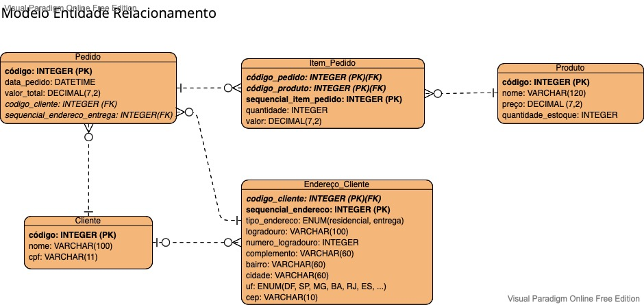
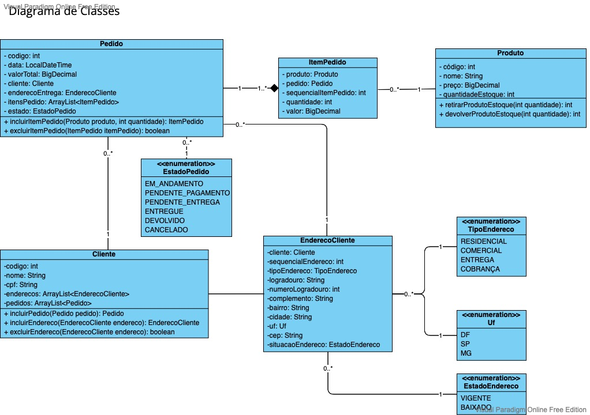

# E-commerce

## 🎯 Objetivo

Trata-se de um sistema de cadastro de produtos e pedidos em um portal de e-commerce.

## 📐 Modelo Entidade-Relacionamento

## 📐 Diagrama de Classes 

## 🛠️ Tecnologias utilizadas

- Linguagem Java (versão 11)
- Spring Data JPA 
- Maven (Gerenciador de dependências)
- GIT (Controle de versão)
- Eclipse (IDE)
- Mysql Versão versão 8.0.28 Community
- Redis 6.2.6

## 👨🏽‍💻👩🏽‍💻 Desenvolvedores 

| [ Alexandre Damião Mendonça Maia](https://github.com/AlexDamiao86) |  [ Fabio Ferreira dos Santos](https://github.com/Mestre-Bio) |  [ Karina Fávero dos Santos](https://github.com/KarinaFSantos) | [ Luis Bernardo Souza Braga](https://github.com/LuBerBraga) |  [ Vanessa Santos e Silva](https://github.com/VANESSA-SS) |
| :---: | :---: | :---: | :---: | :---: |

## Como subir o projeto

1. Criar um banco Mysql com o valor: "ecommerce" 
2. Alterar as configurações de acesso ao banco nos arquivos:
	src/main/resources/applications.properties
	src/main/resources/database.properties
3. Fazer o build do projeto, para obter as dependências e clicar em iniciar - Projeto Eclipse

>
>Projeto realizado como requisito para conclusão da disciplina Persistence do MBA Full Stack Development - FIAP 2022
>Prof. Rafael Matsuyama (https://github.com/rafaelmatsuyama)
